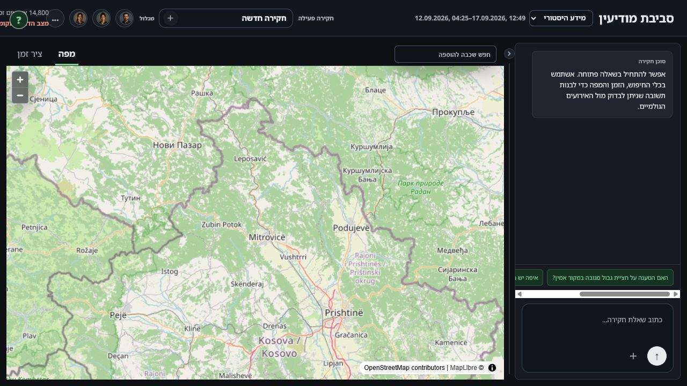
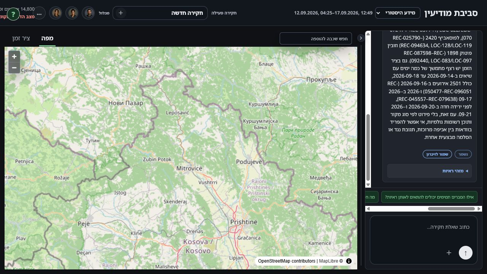
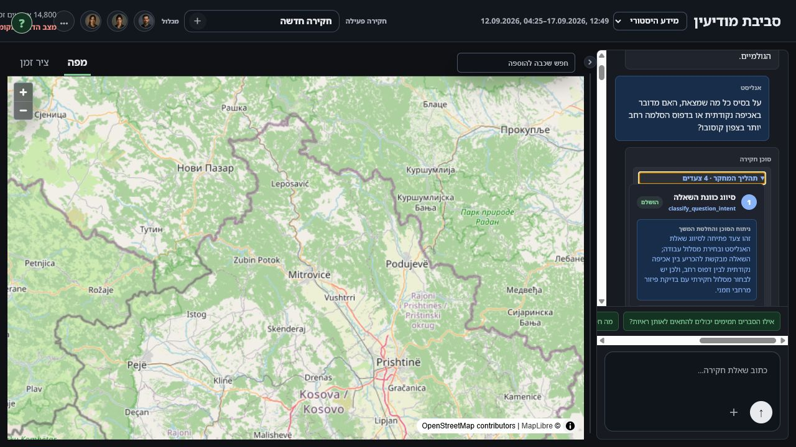
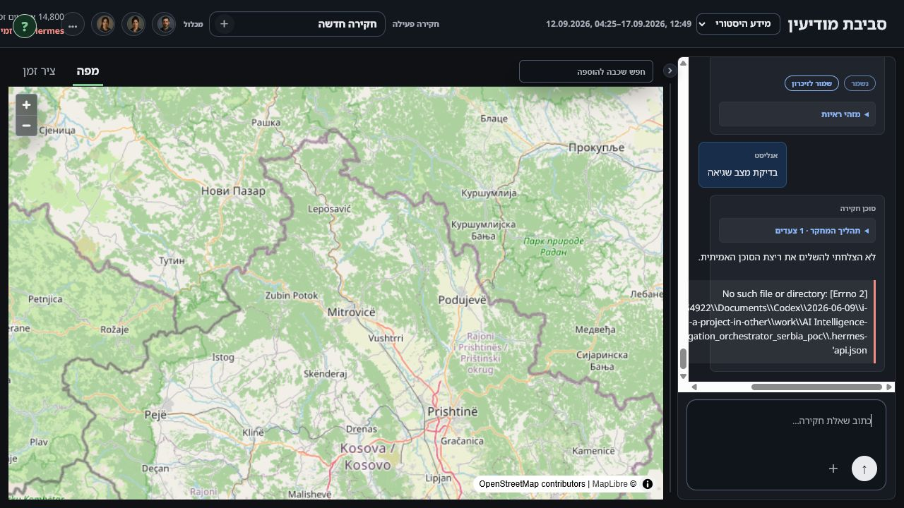

# UX audit: agent responses in chat

## Scope and evidence

This audit covers welcome, successful retrieval and investigation answers, clarification, no/partial results, Moshe/target responses, workstream creation and updates, playback status, continuation, saved replay, and errors. Visual inspection used the exact committed UI running locally because the VM page could not be captured through its self-signed certificate. Live Hermes behavior was therefore inspected through code and recorded run fixtures, not a new production run.

### 1. Empty chat — needs improvement

The welcome is understandable, but the generic paragraph occupies valuable space. Suggested prompts overflow horizontally in the narrow panel. Replace the paragraph with one sentence and stack two or three short starter actions.

### 2. Investigation result — poor

The answer is one dense paragraph containing the conclusion, municipality counts, dates, caveats, and many `REC`/`LOC` identifiers. The evidence toggle exists, so most inline identifiers are redundant. Use a verdict headline, up to three findings, and one limitation; keep IDs in evidence details.

Across five recorded answers, the median was 952 characters/115 words and the maximum was 1,415 characters/192 words. That is too dense for this panel width even though the agent prompt already requests brevity.

### 3. Expanded research trace — poor

Expanded steps repeat rationale, input, output, tool name, and actions. Some summaries enumerate 145 locations or expose full ID arrays. Replace the default step body with one outcome line and move arguments/results into their existing disclosures.

### 4. Error response — critical

The user-facing failure sentence is followed by a raw filesystem path and missing configuration filename. This is neither actionable nor appropriate as default chat content. Show a recovery instruction and hide diagnostic details behind a technical disclosure or server logs.

## Cross-cutting findings

1. **No semantic answer renderer.** `answerHtml` renders mostly free-form paragraphs, while `cleanAssistantAnswer` removes only investigation-step labels. Brevity is prompt-dependent rather than enforced.
2. **Evidence competes with the conclusion.** Canonical identifiers are in prose even when a separate evidence layer exists.
3. **The trace behaves like a debugger.** Internal tool names, raw arrays, and exhaustive location lists appear in the conversational surface.
4. **Continuations duplicate context.** The continuation path can reproduce earlier steps in a new bubble instead of showing only the delta.
5. **Routine state becomes chat noise.** Playback polling writes operational messages that should be transient status UI.
6. **Large artifacts have no summary boundary.** Workstream updates can render every indication instead of a count and top change.

## Recommended information hierarchy

The direct answer must be the only primary content. Findings are secondary. Coverage/uncertainty is tertiary but always visible when material. Evidence, research process, raw arguments, full workstream artifacts, and diagnostics are disclosures.

## Product recommendation

Adopt the typed response contract in `capability-brief.md`. Keep prompt guidance, but enforce shape at the agent gateway, validate lengths/counts, render by response kind, and retain a legacy fallback. This makes the response predictable without losing auditability.

